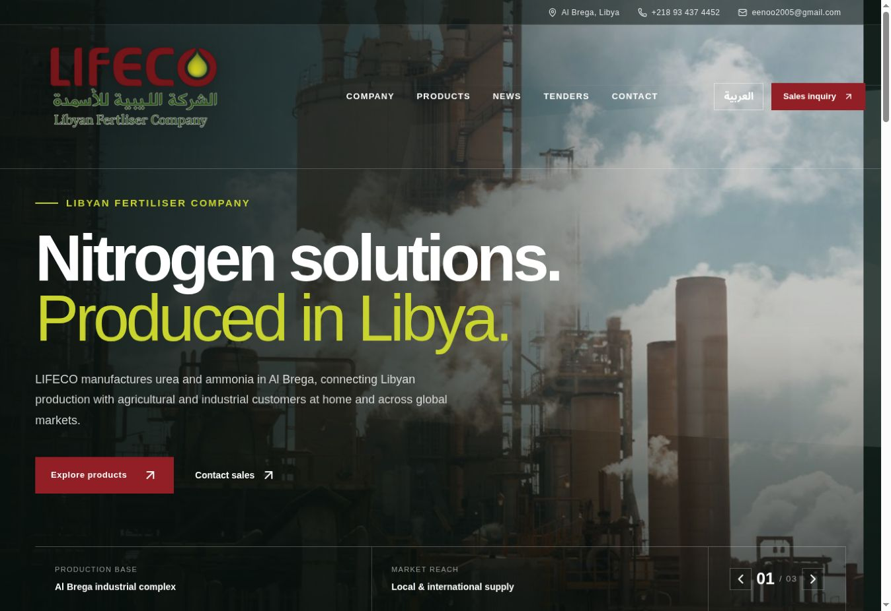
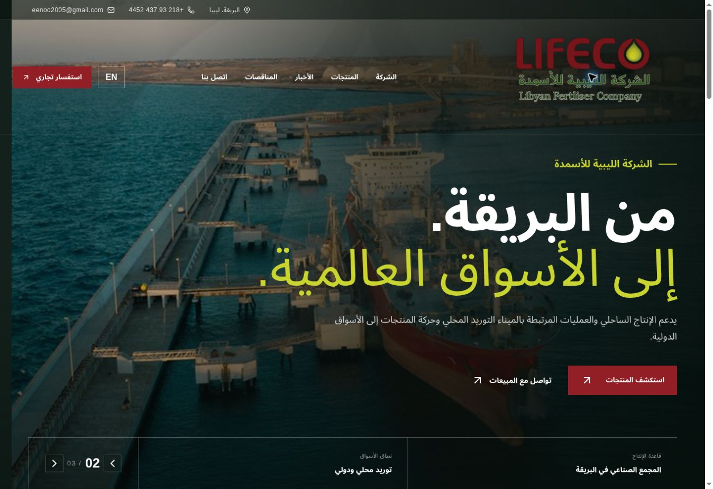
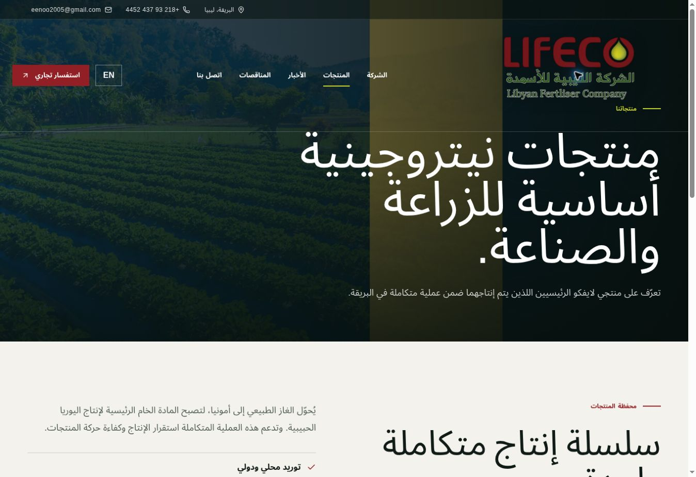
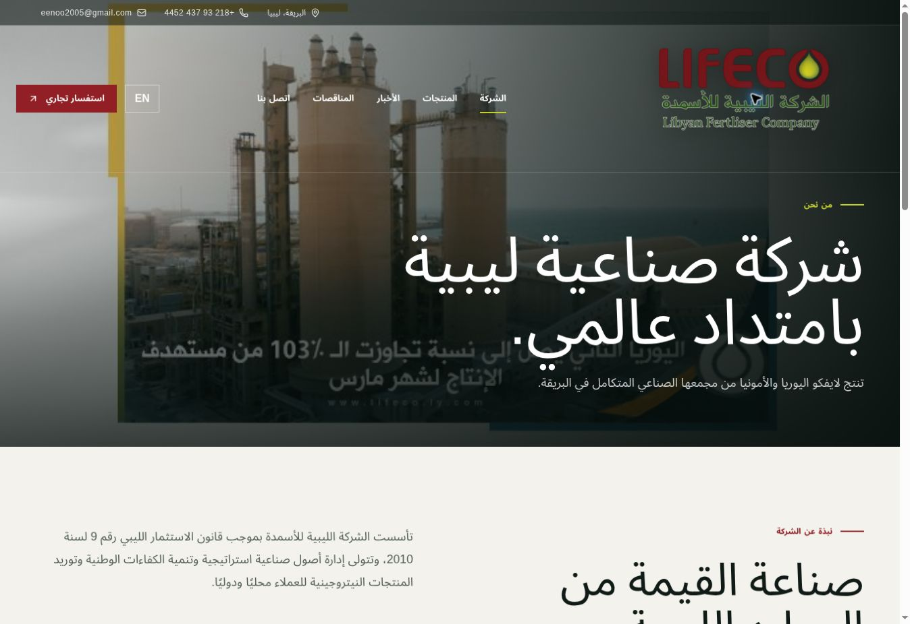
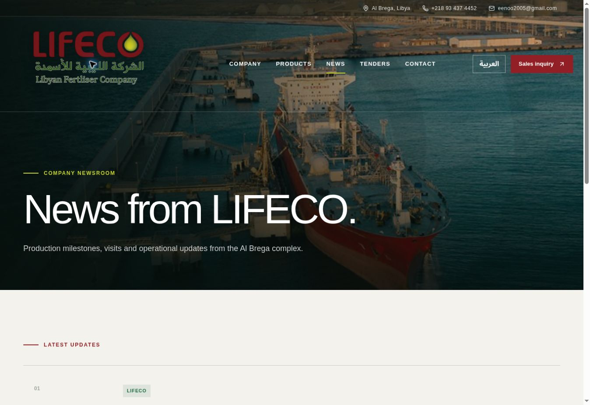
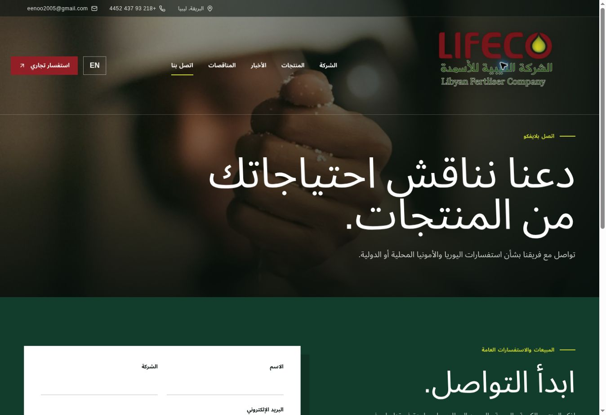
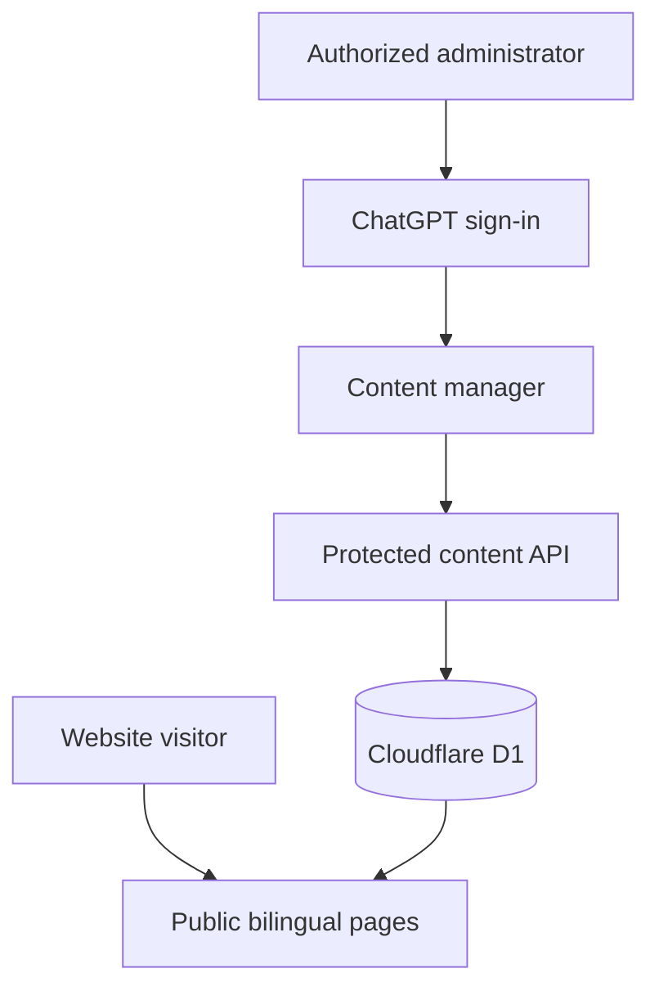

# LIFECO Corporate Website


A full-stack bilingual corporate website concept for **LIFECO — Libyan Fertiliser Company**, a producer and supplier of urea and ammonia based in Al Brega, Libya.

The project turns a traditional company website into a responsive multi-page experience with English/Arabic localization, RTL layouts, product pages, an animated industrial hero, and a protected content-management workflow.

> **Portfolio notice:** This repository presents an independent portfolio redesign. It should not be interpreted as LIFECO's official production website unless formally adopted by the company.

## Live demo

**[Open the deployed website](https://lifeco-fertiliser-company.eenoo2005.chatgpt.site)**

The deployment is currently owner-private while the content is being reviewed.

## Preview

### English landing page



### Arabic RTL experience



### Arabic products page



### More screens

| Company profile — Arabic | Newsroom — English |
| --- | --- |
|  |  |

### Contact experience — Arabic



## Key features

- Complete English and Arabic interfaces with persistent language selection
- Native right-to-left layout and typography behavior for Arabic
- Responsive desktop, tablet, and mobile navigation
- Three-slide industrial hero with subtle smoke and reduced-motion support
- Dedicated Company, Products, News, Tenders, and Contact routes
- Detailed urea and ammonia product pages
- Public news and tender feeds backed by Cloudflare D1
- Protected content manager with ChatGPT sign-in and a server-side administrator allowlist
- Bilingual publishing form with draft/published states
- Safe deletion confirmation for managed content
- Email enquiry workflow with prepared product-supply details
- Branded favicon and semantic, accessible page structure

## Architecture



## Tech stack

| Area | Technology |
| --- | --- |
| UI | React 19, TypeScript 5, CSS |
| Routing | Next.js-compatible App Router |
| Build | Vinext, Vite |
| Database | Cloudflare D1 / SQLite |
| Schema and migrations | Drizzle ORM, Drizzle Kit |
| Authentication | Sign in with ChatGPT helpers |
| Validation | Zod |
| Components | Radix UI, shadcn primitives |
| Icons | Lucide React |
| Hosting | Cloudflare-compatible Worker deployment |

## Routes

| Route | Purpose |
| --- | --- |
| `/` | Corporate landing page |
| `/company` | Profile, ownership, priorities, and leadership |
| `/products` | Product portfolio |
| `/products/urea` | Urea specifications and supply CTA |
| `/products/ammonia` | Ammonia profile and supply CTA |
| `/news` | News archive and managed updates |
| `/tenders` | Procurement notices and supplier guidance |
| `/contact` | Commercial enquiry form |
| `/admin` | Protected bilingual content manager |

## Local development

### Requirements

- Node.js 22.13 or newer
- pnpm 11

### Setup

```bash
git clone https://github.com/eenoo2005-star/lifeco-corporate-website.git
cd lifeco-corporate-website
pnpm install
pnpm dev
```

Create a production build:

```bash
pnpm build
```

Generate a migration after changing `db/schema.ts`:

```bash
pnpm db:generate
```

The hosted version expects a D1 binding named `DB`. Authentication headers are supplied by the hosting platform; do not trust administrator identity sent by browser code.

## Project structure

```text
app/
  admin/                 Protected content manager
  api/content/           D1-backed content API
  company/               Corporate profile
  products/              Product overview and details
  news/                  News archive
  tenders/               Procurement information
  contact/               Commercial enquiries
components/
  site-shell.tsx         Shared bilingual navigation and footer
  public-content.tsx     Managed public content feed
db/
  schema.ts              D1 schema
drizzle/                 Generated SQL migrations
docs/screenshots/        Portfolio documentation images
public/assets/           Brand and industrial imagery
```

## Design decisions

- **Red and green brand system:** derived from the supplied LIFECO identity.
- **Large-format industrial imagery:** communicates production scale immediately.
- **Separated information architecture:** avoids placing every corporate topic on one long page.
- **Bilingual-first implementation:** both languages are complete experiences rather than translated labels added later.
- **Server-side authorization:** the administrator allowlist is checked for every write request.

## Content and image attribution

Company facts and reference imagery were adapted from the [official LIFECO website](https://lifeco.com.ly/). LIFECO names, logos, and company photography remain the property of their respective rights holders and are included here only to document this portfolio implementation.

## Author

**Shahin Idris Almaghrabi**  
Software Engineering student and IT developer  
[GitHub profile](https://github.com/eenoo2005-star)
